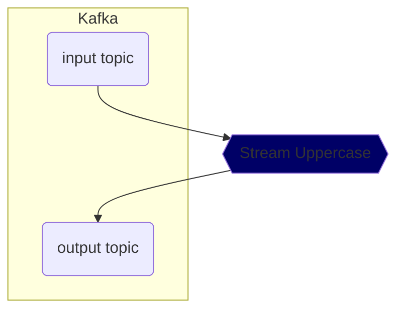

## Kafka Redis Store

Is a naive implementation of Kafka's ReadOnlyStore - just to compare it with RocksDB

```mermaid
flowchart TB
    IN --> APP{{Stream Uppercase}}:::someclass
    APP --> OUT
    
    subgraph Kafka
        direction LR
        IN(input topic) 
        OUT(output topic)
    end

        
    click IN callback "Kafka Topic: input-topic"
    click OUT callback "Kafka Topic: output-topic"
    click APP callback "Kafka streams app: upper casing operation"
    classDef someclass fill:#006
```
