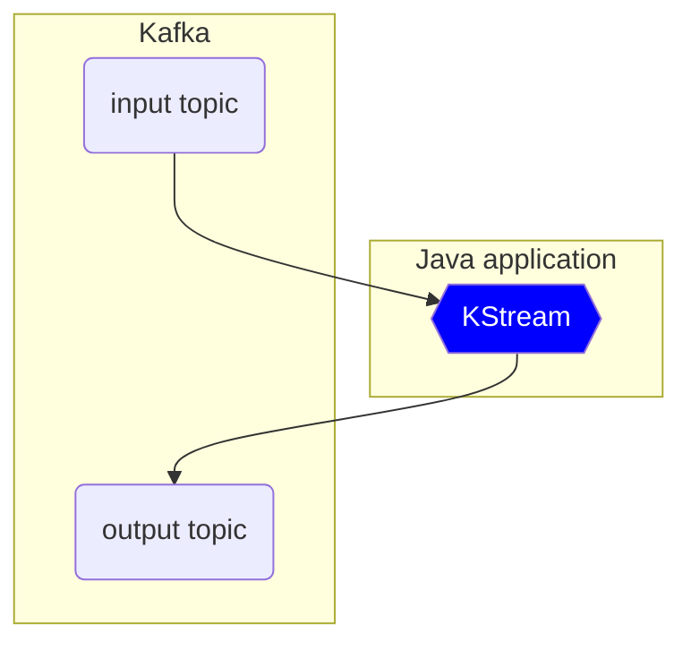
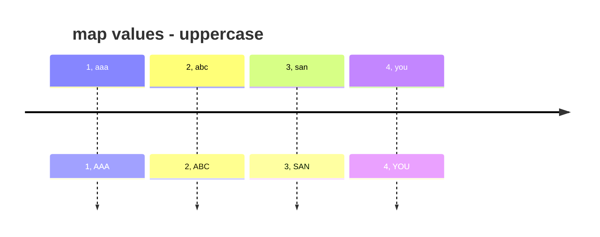
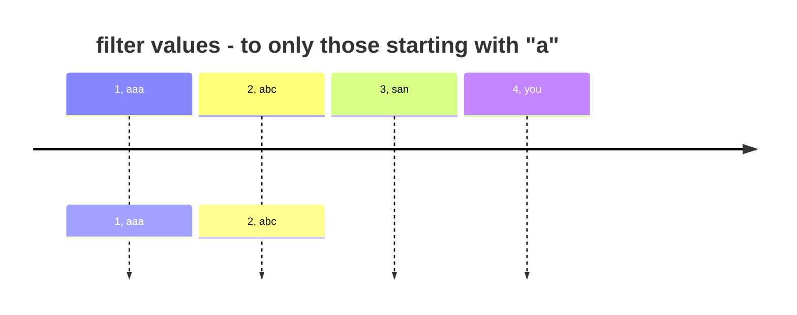
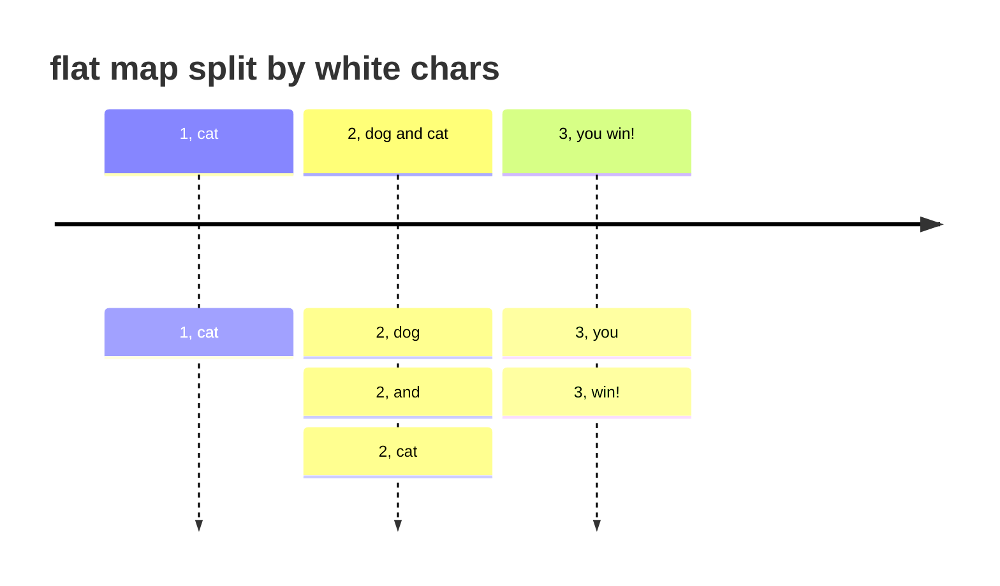
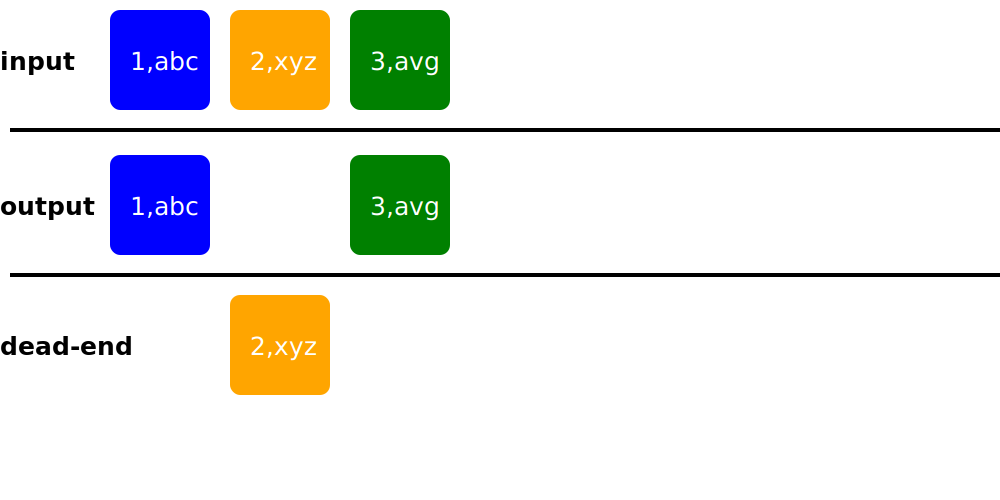

### Kafka Streams explained

Kafka streams is a Java library to process data from Kafka topics and save data to kafka topics



## Kafka Streams artifacts

KStreams is a stream of data in created in the app

### KStreams

> KStream definition
: is an abstraction of partitioned record stream, in which data is represented using insert semantics 
> i.e. each record is independent of other events 

As a developer you can consider KStream as never ending (unbound) event log, 
which you can modify using kafka stream operations.

important properties:
- always insert only
- similar to Log
- unbounded data stream

what does the unbound mean ?
: having start but not end - being possibly infinite at the end


| Topic(key, value) | KStream             |
|-------------------|---------------------|
| (a,1)             | (a,1)               |
| (b,1)             | (a,1), (b,1)        | 
| (a,2)             | (a,1), (b,1), (a,2) |


### KTable


> KTable
: is a table of key value records, which are upserted 

- upserts on non null values
- deletes on null values
- similar to table
- parallel with log compacted topics


| Topic(key, value) | KStream             |
|-------------------|---------------------|
| (a,1)             | (a,1)               |
| (b,1)             | (a,1), (b,1)        | 
| (a,2)             | (a,2), (b,1)        |
| (b,2)             | (a,2), (b,2)        |
| (c,3)             | (a,2), (b,2), (c,3) |
| (a,null)          | (b,2), (c,3)        |


### KStream/KTable transformations

There are two main categories of transformations: **stateless** and **stateful** transformations


### Stateless Transformations
Stateless transformations are transformations which do not require state for processing.
Below you could find a couple of basic stateless transformations examples with processing visualization. 

Detailed documentation can be found at [Stateless Transformations] documentation page.

#### mapValues and map 

Mapping values in record stream

*mapValue* and *map*

e.g.
Let's assume our source is stream of key value events, where **key is an integer** and **value is a string**.

Stream is processed as follows:
```jshelllanguage
// using lambda expression on KStream<byte[],String>
stream.mapValues(value -> value.toUpperCase());
```
Each event in the stream is processed one by one as it's shown on a timeline:
 

> TIP: notice that the keys are not changed in the output stream

repartitioning operations
: mapValues is cheaper than map, since map is causing repartitioning,
thus use mapValues whenever possible


#### Filter and filterNot

Filtering records in stream

e.g. remove all records not starting with "a"

```jshelllanguage
// using lambda expression on KStream<byte[],String>
stream.filter((key, value) -> value.startsWith("a"));
```
gives us:

#### Flatmap

Takes one record and produces zero one or more records

e.g. split input messages by white characters

```jshelllanguage
// using lambda expression on KStream<byte[],String>
stream.flatMapValues(value -> value.split("\\s+"));
```
gives us:

#### Split

Split stream into branches.

e.g. split input stream records by value into branches **branch-a** and **branch-b** 
by words starting with letter **a** and send them to **output topic** and all other to **dead-end topic**

```jshelllanguage
    var branches = stream.split(Named.as("branch-"))
             .branch((k, v) -> v.startsWith("a"), 
                       Branched.as("a"))
                .branch((k, v) -> !v.startsWith("a"),
                        Branched.as("b"))
                .noDefaultBranch();
    branches.get("branch-a").to(outputTopic, Produced.with(stringSerde, stringSerde));
    branches.get("branch-b").to(deadEndTopic, Produced.with(stringSerde, stringSerde));
```





[Stateless Transformations]: https://docs.confluent.io/platform/current/streams/developer-guide/dsl-api.html#stateless-transformations
